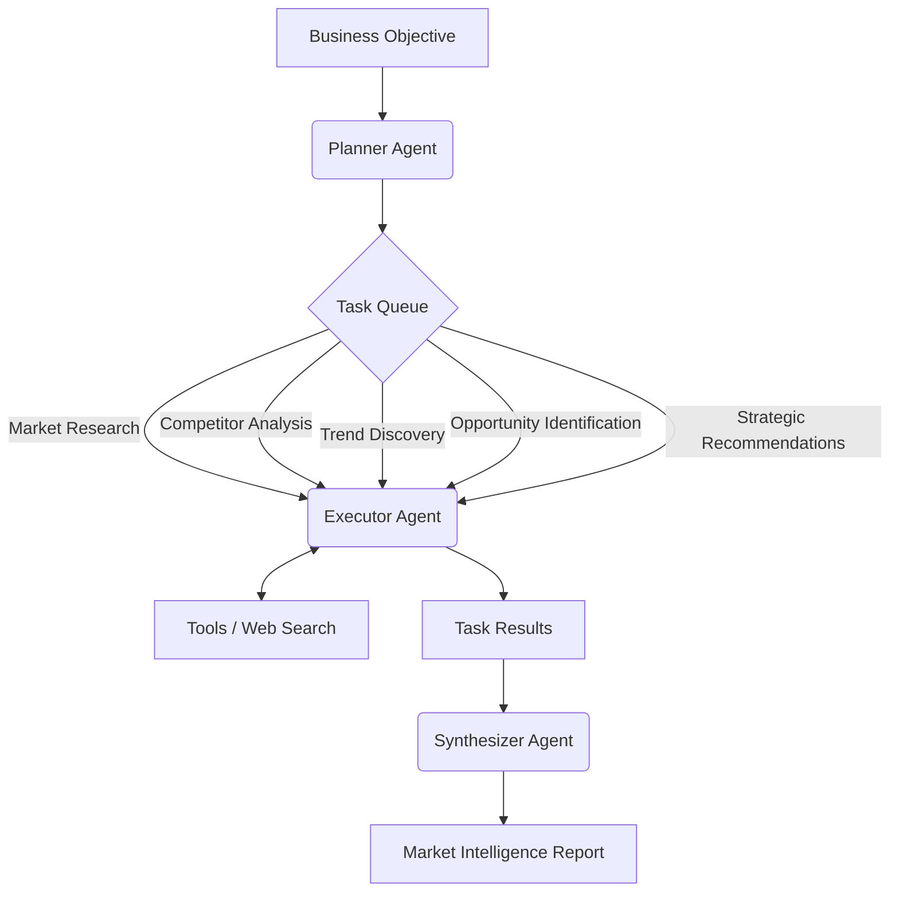

# Agentic Market Intelligence

🏆 Built for Google Agentic Architect Sprint 2026

**Project Topic:** Fully Autonomous Goal Execution (/goal)

Agentic Market Intelligence is a fully autonomous market research system built with Google Antigravity and Gemini. The system accepts a single business objective and autonomously plans, executes, verifies, and synthesizes multiple research tasks before producing a comprehensive market intelligence report.

---

## Overview

Traditional chatbots rely on prompt-response interactions and require users to manually guide the research process. In contrast, Agentic Market Intelligence follows a goal-oriented workflow where the system independently carries the cognitive load of planning, research, analysis, and report generation.

The project demonstrates:

- Fully Autonomous Goal Execution
- Autonomous Planning
- Goal Decomposition
- Iterative Task Execution
- Task Completion Verification
- Closed-Loop Execution
- Report Synthesis

---

## Architecture



---

## Autonomous Workflow

```text
1. User provides a business objective
2. Planner Agent generates an execution plan
3. Executor Agent performs research tasks
4. Results are validated and stored
5. Synthesizer Agent compiles findings
6. Final report is generated automatically
```

Unlike traditional chatbot interactions, no manual step-by-step guidance is required after the initial objective is provided.

---

## Example Objective

```text
Analyze the electric vehicle market in Europe for 2026.
```

---

## Example Output

```text
Market Research

Competitor Analysis

Trend Discovery

Opportunity Identification

Strategic Recommendations

Executive Summary

Final Assessment
```

---

## Features

### Autonomous Planning

The Planner Agent transforms a high-level business objective into a structured execution plan.

### Goal Decomposition

Complex business questions are decomposed into specialized analytical phases:

- Market Research
- Competitor Analysis
- Trend Discovery
- Opportunity Identification
- Strategic Recommendations

### Iterative Execution

The Executor Agent processes tasks sequentially and builds knowledge across completed stages.

### Report Synthesis

The Synthesizer Agent combines all findings into a professional market intelligence report.

---

## Technical Architecture Analysis

This project demonstrates Fully Autonomous Goal Execution through:

- Autonomous Planning
- Goal Decomposition
- Iterative Task Execution
- Task Completion Verification
- Closed-Loop Execution
- Report Synthesis

By wrapping LLM reasoning in a structured execution framework, the system transforms a single business objective into a complete market intelligence report without requiring additional human intervention.

---

## How Google Antigravity Was Used

Google Antigravity IDE was used throughout the project lifecycle to:

- Design system architecture
- Generate implementation scaffolding
- Refine agent workflows
- Develop autonomous execution patterns
- Produce technical analysis
- Create project documentation

The project explores how Antigravity can accelerate the development of goal-oriented agentic systems while maintaining clear separation between planning, execution, and synthesis stages.

---

## Screenshots

### Google Antigravity IDE

images/ide.png

### Architecture Generation

images/architecture.png

### Autonomous Execution

images/execution.png

### Final Market Intelligence Report

images/report.png

---

## Getting Started

### Install Dependencies

```bash
py -m pip install -r requirements.txt
```

### Configure Environment

Create a `.env` file in the project root:

```env
GEMINI_API_KEY=your_api_key_here
```

### Run

```bash
py -m src.main --objective "Analyze the electric vehicle market in Europe for 2026."
```

---

## Repository Structure

```text
src/
├── agents/
│   ├── planner.py
│   ├── executor.py
│   └── synthesizer.py
│
├── core/
│   ├── models.py
│   └── llm_client.py
│
├── tools/
│   └── web_search.py
│
└── main.py

data/
└── sample_report.md
```

---

## Agentic Architect Sprint 2026

### Project Title

**Agentic Market Intelligence: Autonomous Competitive Research using Google Antigravity**

### Project Topic

**Fully Autonomous Goal Execution (/goal)**

This project demonstrates how an autonomous system can independently plan, execute, and complete complex market intelligence workflows starting from a single business objective.

---

## Future Work

- Multi-Agent Collaboration
- Browser Automation
- Human-in-the-Loop Approval Gates
- Continuous Market Monitoring
- Autonomous Competitive Tracking
- Scheduled Research Pipelines

---

## Technologies

- Google Antigravity IDE
- Gemini
- Python
- Pydantic
- AsyncIO
- GitHub

---

## License

MIT License